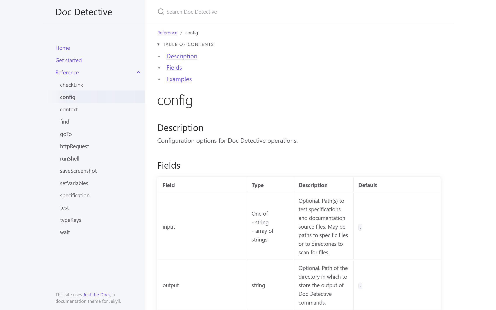

# Doc Detective documentation overview

<!-- testStart
testId: search-kittens
detectSteps: false
steps:
  - goTo: http://doc-detective.com
  - goTo: https://doc-detective.com/get-started.html
  - goTo: https://doc-detective.com/reference/
  - goTo: https://doc-detective.com/reference/schemas/config.html
  - find:
      selector: h2#description
      elementText: Description
  - find:
      selector: h2#fields
      elementText: Fields
  - find:
      selector: h2#examples
      elementText: Examples
  - screenshot: reference.png
-->

[Doc Detective documentation](http://doc-detective.com) is split into a few key sections:

- The landing page discusses what Doc Detective is, what it does, and who might find it useful.
- [Get started](https://doc-detective.com/get-started.html) covers how to quickly get up and running with Doc Detective.
- The [references](https://doc-detective.com/reference/) detail the various JSON objects that Doc Detective expects for configs, test specifications, tests, actions, and more. Each object schema includes an object description, field definitions, and examples.

{ .screenshot }

<!-- testEnd -->
